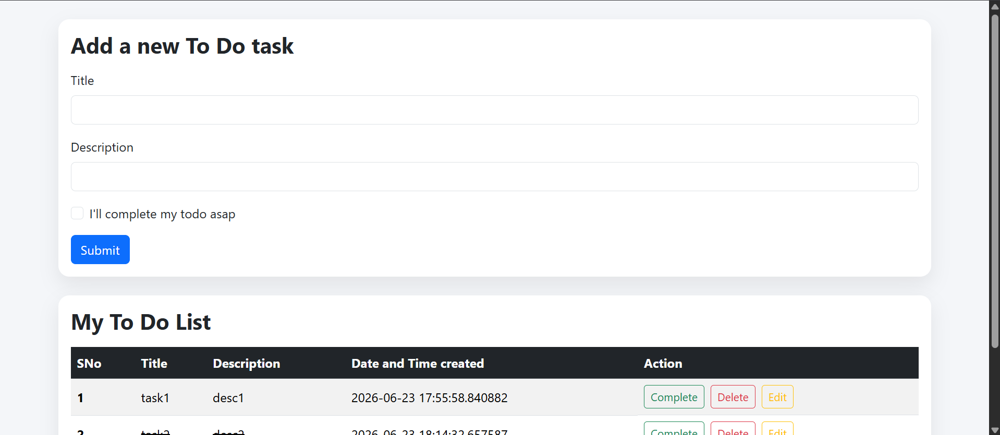
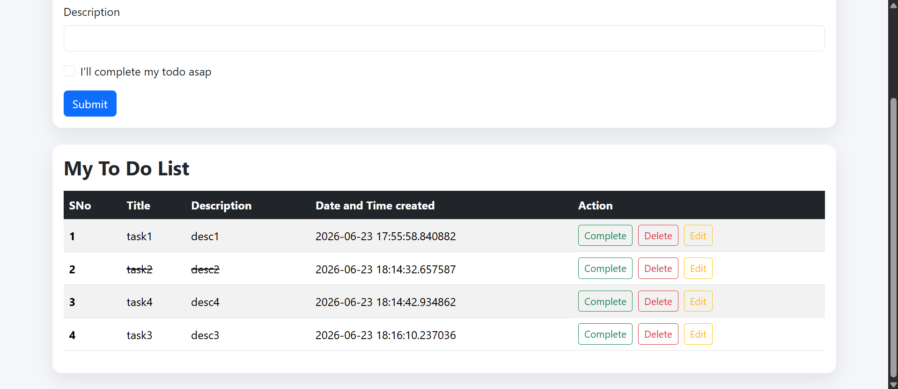
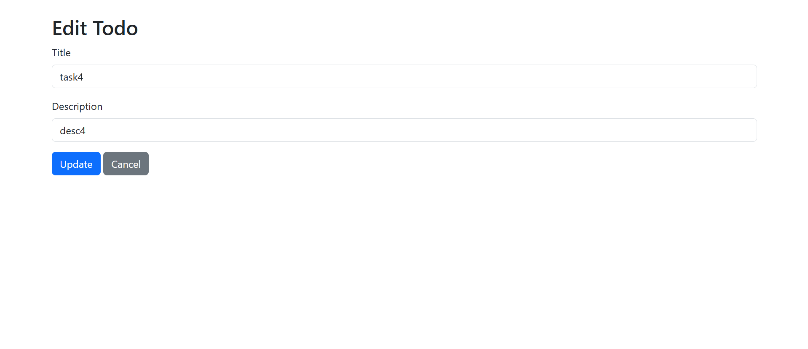

# 📝 Flask To-Do App

A simple **To-Do web application** built with **Flask** and **SQLAlchemy**, using SQLite as the database styled with **Bootstrap**. Track your tasks easily and efficiently!

---

## ✨ Features

- Add tasks with **Title** and **Description**
- Mark tasks as **Complete** (strikethrough style)
- Edit tasks easily
- Delete tasks
- Tasks show the **date and time created**
- Responsive and simple UI using **Bootstrap**
- CRUD operations

---

## Screenshots

### Add a new to-do

### List of all to-dos

### Edit a to-do

## 📂 Project Structure

# Project Structure

├── app.py
├── templates/
│   ├── index.html
│   ├── edit.html
│   └── thankss.html
├── static/
├── images/
│   ├── add a new to-do.png
│   ├── all to-do lists.png
│   └── edit a to-do.png
├── instance/
│   └── todo.db             # Database
├── env/
│   └── (virtual environment files)
├── .gitignore
└── README.md
